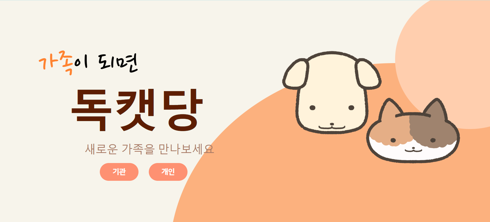
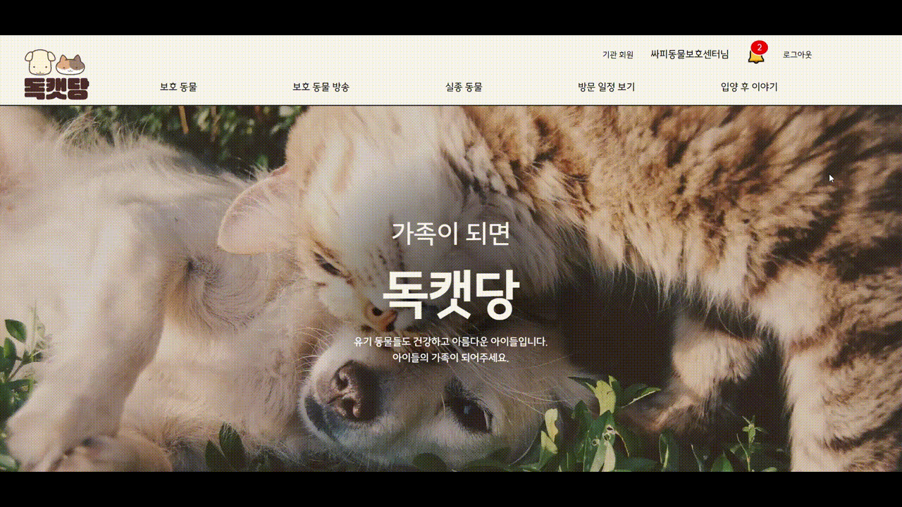
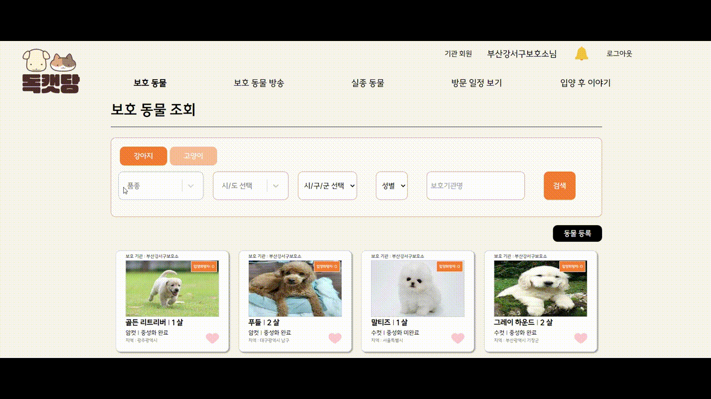
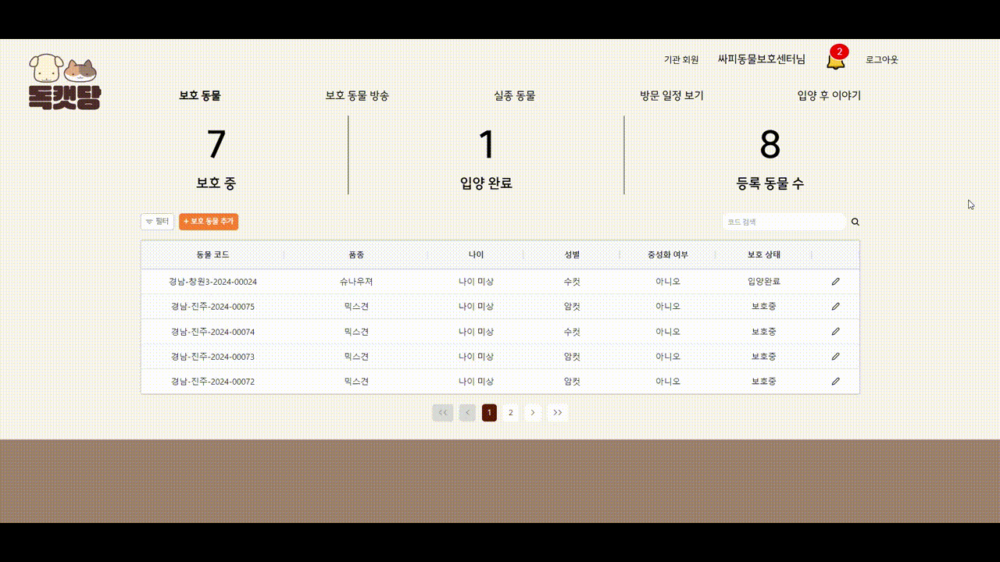
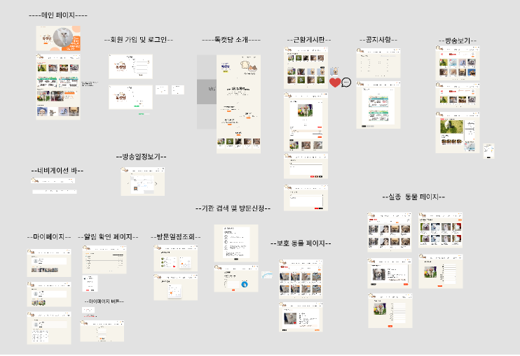
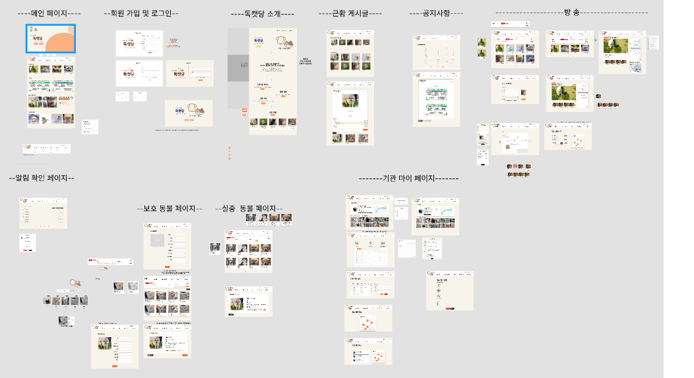
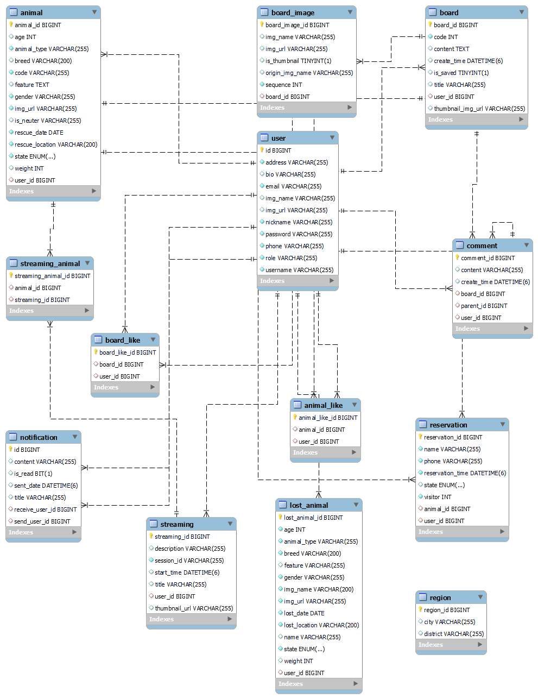
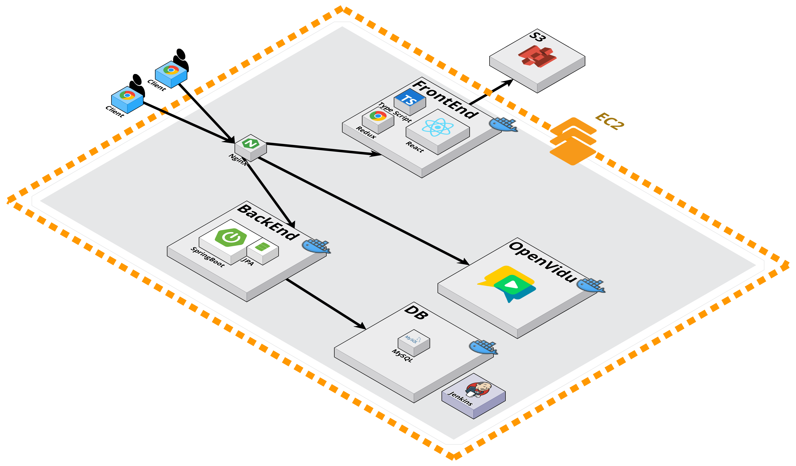

# 🐶독캣당🐱

> 유기견 & 유기묘 입양 독려하는 방송 서비스


# 목차


1. [개요](#item-one)
2. [서비스 화면](#item-two)
3. [주요 기능](#item-three)
4. [개발 환경](#item-four)
5. [기술 소개](#item-five)
6. [설계 문서](#item-six)
7. [팀원 소개](#item-end)

<br><br>

<a id="item-one"></a>

# 개요

- 개발 기간: 2024.01.08 ~ 2024.02.16
- 삼성 청년 소프트웨어 아카데미(SSAFY) WebRTC 프로젝트

<br><br>

<a id="item-two"></a>

# 2. 📺서비스 화면

## 2.1 랜딩 페이지



## 2.2 메인 페이지



<a id="item-three"></a> 

# 3. 주요 기능

## 3.1 방송 시청


- 방송을 보며 실시간 채팅에 참여할수있다.
- 방송 시청 중에도 관심있는 동물이 생겼을 경우 PIP 모드로 동물들의 상세 정보를 구경할 수 있다.

## 3.2 보호동물 동물 찾기



- 보호기관에 등록되어있는 동물들을 찾아 볼 수 있다.
- 원하는 조건을 찾아 검색하여 볼 수 있다.

## 3.3 기관의 데이터 관리



- 등록된 동물들을 한곳에서 관리할 수 있다.

## 3.4 기관의 방문 예약 관리


- 개인 회원의 방문신청 승인 거절을 할 수 있다.
- 확정된 예약일정 관리 할 수 있다.

<a id="item-four"></a>

# 4. 개발 환경

## ⚙ Management Tool

- 형상 관리 : Gitlab
- 이슈 관리 : Jira
- 커뮤니케이션 : Mattermost, Webex, Notion, Discord
- 디자인 : Figma, PowerPoint

## 💻 IDE

- Visual Studio Code `1.18.5`
- IntelliJ IDEA community `2023.3.2`

## 📱 Frontend

- React `18.2.0`
- Vite `^5.0.8`
- Typescript `5.2.2`

## 💾 Backend

- Springboot `3.22`
- Spring Data JPA
- MySql 8.0.34

## Infra

- AWS S3
- AWS EC2
- Nginx 1.18.0
- Docker: 25.0.3
  - openvidu: 2.29.0
  - mysql: 8.3.0
- Ubuntu 20.04.6 LTS

<a id="item-five"></a>

# 5. 기술 소개

<a id="item-six"></a>

# 6. ⚙ 설계 문서

## 🎨 와이어프레임

### - 개인 와이어프레임



### - 기관 와이어프레임



## 📃 요구사항 명세서

- [요구사항 명세서](https://docs.google.com/spreadsheets/d/1ZLI7sLIl_ei3g1UbczJ_970uipbRo7nZNDduVcPJtCk/edit#gid=434359381)

## 📝 API 명세서


- [API 명세서](https://www.notion.so/iamyouj/API-4f85636b6f18405a8b1870d5c22c27f3)

## 📏 ERD



## 📐 시스템 아키텍처



## 🧾컴포넌트

### FE

<details>
<summary>Front-End</summary>
<div markdown="1">

```
┗📦src
 ┣ 📂components
 ┃ ┣ 📂common
 ┃ ┃ ┣ 📜 AlertModal.tsx
 ┃ ┃ ┣ 📜 Button.tsx
 ┃ ┃ ┣ 📜 Design.tsx
 ┃ ┃ ┣ 📜 Error.tsx
 ┃ ┃ ┣ 📜 Footer.tsx
 ┃ ┃ ┣ 📜 Icons.tsx
 ┃ ┃ ┣ 📜 LoadingOrError.tsx
 ┃ ┃ ┣ 📜 NavBar.tsx
 ┃ ┃ ┣ 📜 Pagination.tsx
 ┃ ┃ ┣ 📜 TextSearch.tsx
 ┃ ┃ ┣ 📜 Title.tsx
 ┃ ┣ 📂users
 ┃ ┃ ┣ 📜 Card.tsx
 ┃ ┃ ┣ 📜 ContentBox.tsx
 ┃ ┃ ┣ 📜 KakaoMap.tsx
 ┃ ┃ ┣ 📜 Line.tsx
 ┃ ┃ ┣ 📜 ProfileBox.tsx
 ┃ ┃ ┣ 📜 ProfileEditModal.tsx
 ┃ ┃ ┣ 📜 Title.tsx
 ┃ ┣ 📂animalinfo
 ┃ ┃ ┣ 📜Input.tsx
 ┃ ┃ ┣ 📜LikeButton.tsx
 ┃ ┃ ┣ 📜search.css
 ┃ ┃ ┣ 📜style.tsx
 ┃ ┃ ┣ 📂lostanimals
 ┃ ┃ ┃ ┣ 📜LostAnimalCard.tsx
 ┃ ┃ ┃ ┣ 📜LostAnimalSearch.tsx
 ┃ ┃ ┣ 📂mungbti
 ┃ ┃ ┃ ┣ 📜 AnimalMatching.tsx
 ┃ ┃ ┣ 📂savedanimals
 ┃ ┃ ┃ ┣ 📜SaveAnimalCard.tsx
 ┃ ┃ ┃ ┣ 📜SaveAnimalSearch.tsx
 ┃ ┃ ┃ ┣ 📜SavedAnimalList.tsx
 ┃ ┣ 📂	articles
 ┃ ┃ ┣ 📜ArticleCard.tsx
 ┃ ┃ ┣ 📜 ArticleContent.tsx
 ┃ ┃ ┣ 📜 ArticleEditor.tsx
 ┃ ┃ ┣ 📜 ArticleInterface.ts
 ┃ ┃ ┣ 📜 ArticleList.tsx
 ┃ ┃ ┣ 📜 Likes.tsx
 ┃ ┃ ┣ 📜 PreviewModal.tsx
 ┃ ┃ ┣ 📂comments
 ┃ ┃ ┃ ┣  📜Comment.tsx
 ┃ ┃ ┃ ┣  📜CommentForm.tsx
 ┃ ┃ ┃ ┣  📜CommentList.tsx
 ┃ ┣ 📂Broadcast
 ┃ ┃ ┣ 📜 AnimalList.tsx
 ┃ ┃ ┣ 📜 AnimalSearchForBroadcast.tsx
 ┃ ┃ ┣ 📜 BroadcastDetail.tsx
 ┃ ┃ ┣ 📜 BroadcastForm.tsx
 ┃ ┃ ┣ 📜 Chat.tsx
 ┃ ┃ ┣ 📜 MyVideo.tsx
 ┃ ┃ ┣ 📜 SessionComponent.tsx
 ┃ ┃ ┣ 📜 simpleEncrypt.ts
 ┃ ┣ 📂notificationss
 ┃ ┃ ┣ 📜NotiModal.tsx
 ┃ ┣ 📂visits
 ┃ ┃ ┣ 📜 AdoptionInfoModal.tsx
 ┃ ┃ ┣ 📜 ReservationInfo.tsx
 ┃ ┃ ┣ 📜 ReservationList.tsx
 ┃ ┃ ┣ 📜ScheduleCard.tsx
 ┣ 📂pages
 ┃ ┣ 📂	users
 ┃ ┃ ┣ 📜SignUpPage.tsx
 ┃ ┃ ┣ 📜SignUpPage.tsx
 ┃ ┃ ┣ 📜ProfilePage.tsx
 ┃ ┃ ┣ 📜VisitManagementPage.tsx
 ┃ ┣ 📂	home
 ┃ ┃ ┣ 📜HomePage.tsx
 ┃ ┃ ┣ 📜LandingPage.tsx
 ┃ ┣ 📂animals
 ┃ ┃ ┣ 📜SavedAnimalManagementPage.tsx
 ┃ ┃ ┣ 📜StyleDetail.tsx
 ┃ ┃ ┣ 📂lostanimals
 ┃ ┃ ┃ ┣ 📜LostAnimalDetailPage.tsx
 ┃ ┃ ┃ ┣ 📜LostAnimalFormPage.tsx
 ┃ ┃ ┃ ┣ 📜LostAnimalListPage.tsx
 ┃ ┃ ┃ ┣ 📜LostAnimalUpdatePage.tsx
 ┃ ┃ ┣ 📂mungbti
 ┃ ┃ ┃ ┣ 📜MungBTIPage.tsx
 ┃ ┃ ┣ 📂savedanimals
 ┃ ┃ ┃ ┣ 📜AnimalDetailPage.tsx
 ┃ ┃ ┃ ┣ 📜AnimalFormPage.tsx
 ┃ ┃ ┃ ┣ 📜AnimalListPage.tsx
 ┃ ┃ ┃ ┣ 📜AnimalUpdatePage.tsx
 ┃ ┣ 📂	visits
 ┃ ┃ ┣ 📜VisitManagementPage.tsx
 ┃ ┃ ┣ 📜VisitReservationListPage.tsx
 ┃ ┃ ┣ 📜VisitReservationPage.tsx
 ┃ ┣ 📂articles
 ┃ ┃ ┣ 📜ArticleDetailPage.tsx
 ┃ ┃ ┣ 📜ArticleListPage.tsx
 ┃ ┃ ┣ 📜articleLoader.ts
 ┃ ┃ ┣ 📜ArticleWritePage.tsx
 ┃ ┣ 📂broadcast
 ┃ ┃ ┣ 📜BoradcastListPage.tsx
 ┃ ┃ ┣ 📜BroadCastPage.tsx
 ┃ ┣ 📂notice
 ┃ ┃ ┣ 📜NoticeListPage.tsx
 ┃ ┣ 📂admin
 ┃ ┃ ┣ 📜AdminPage.tsx
 ┃ ┣ 📂message
 ┃ ┃ ┣ 📜MessageListPage.tsx
 ┣ 📂store
 ┃ ┣ 📜 broadcastSlice.ts
 ┃ ┣ 📜 store.ts
 ┣ 📂utils
 ┃ ┣ 📜articleAPI.ts
 ┃ ┣ 📜axios.ts
 ┃ ┣ 📜broadcastAPI.ts
 ┃ ┣ 📜LostAPI.ts
 ┃ ┣ 📜notificationsAPI.ts
 ┃ ┣ 📜S3.ts
 ┃ ┣ 📜SaveAPI.ts
 ┃ ┣ 📜tanstackQuery.ts
 ┃ ┣ 📜uitl.ts
 ┃ ┣ 📜UserAPI.ts
 ┃ ┣ 📜VisitAPI.ts
 ┣ 📜App.tsx
 ┗ 📜main.tsx
```

</div>
</details>

<details>
<summary>Back-End</summary>
<div markdown="1">

 ```
 📦dogcatdang
 ┣ 📂animal
 ┃ ┣ 📂controller
 ┃ ┃ ┣ 📜AnimalController.java
 ┃ ┃ ┗ 📜AnimalShelterController.java
 ┃ ┣ 📂dto
 ┃ ┃ ┣ 📜RequestAnimalDto.java
 ┃ ┃ ┣ 📜RequestAnimalSearchDto.java
 ┃ ┃ ┣ 📜RequestShelterSearchDto.java
 ┃ ┃ ┣ 📜ResponseAnimalDto.java
 ┃ ┃ ┣ 📜ResponseAnimalListDto.java
 ┃ ┃ ┣ 📜ResponseAnimalPageDto.java
 ┃ ┃ ┣ 📜ResponseSavedIdDto.java
 ┃ ┃ ┣ 📜ResponseShelterAnimalCountDto.java
 ┃ ┃ ┣ 📜ResponseShelterAnimalDto.java
 ┃ ┃ ┗ 📜ResponseShelterAnimalPageDto.java
 ┃ ┗ 📂service
 ┃ ┃ ┣ 📜AnimalLikeService.java
 ┃ ┃ ┣ 📜AnimalLikeServiceImpl.java
 ┃ ┃ ┣ 📜AnimalService.java
 ┃ ┃ ┗ 📜AnimalServiceImpl.java
 ┣ 📂board
 ┃ ┣ 📂controller
 ┃ ┃ ┗ 📜BoardController.java
 ┃ ┣ 📂dto
 ┃ ┃ ┣ 📜RequestBoardDto.java
 ┃ ┃ ┣ 📜RequestBoardSearchDto.java
 ┃ ┃ ┣ 📜ResponseBoardBestDto.java
 ┃ ┃ ┣ 📜ResponseBoardDto.java
 ┃ ┃ ┣ 📜ResponseBoardSummaryDto.java
 ┃ ┃ ┗ 📜ResponseDto.java
 ┃ ┗ 📂service
 ┃ ┃ ┣ 📜BoardService.java
 ┃ ┃ ┗ 📜BoardServiceImpl.java
 ┣ 📂comment
 ┃ ┣ 📂controller
 ┃ ┃ ┗ 📜CommentController.java
 ┃ ┣ 📂dto
 ┃ ┃ ┣ 📜RequestCommentDto.java
 ┃ ┃ ┣ 📜ResponseCommentDto.java
 ┃ ┃ ┗ 📜ResponseSavedIdDto.java
 ┃ ┗ 📂service
 ┃ ┃ ┣ 📜CommentService.java
 ┃ ┃ ┗ 📜CommentServiceImpl.java
 ┣ 📂config
 ┃ ┗ 📜S3Config.java
 ┣ 📂db
 ┃ ┣ 📂entity
 ┃ ┃ ┣ 📜Animal.java
 ┃ ┃ ┣ 📜AnimalLike.java
 ┃ ┃ ┣ 📜Board.java
 ┃ ┃ ┣ 📜BoardLike.java
 ┃ ┃ ┣ 📜Comment.java
 ┃ ┃ ┣ 📜LostAnimal.java
 ┃ ┃ ┣ 📜Notification.java
 ┃ ┃ ┣ 📜RefreshToken.java
 ┃ ┃ ┣ 📜Region.java
 ┃ ┃ ┣ 📜Reservation.java
 ┃ ┃ ┣ 📜Streaming.java
 ┃ ┃ ┣ 📜StreamingAnimal.java
 ┃ ┃ ┗ 📜User.java
 ┃ ┗ 📂repository
 ┃ ┃ ┣ 📜AnimalLikeRepository.java
 ┃ ┃ ┣ 📜AnimalRepository.java
 ┃ ┃ ┣ 📜BoardLikeRepository.java
 ┃ ┃ ┣ 📜BoardRepository.java
 ┃ ┃ ┣ 📜CommentRepository.java
 ┃ ┃ ┣ 📜LostAnimalRepository.java
 ┃ ┃ ┣ 📜NotificationRepository.java
 ┃ ┃ ┣ 📜RefreshTokenRepository.java
 ┃ ┃ ┣ 📜RegionRepository.java
 ┃ ┃ ┣ 📜ReservationRepository.java
 ┃ ┃ ┣ 📜StreamingAnimalRepository.java
 ┃ ┃ ┣ 📜StreamingRepository.java
 ┃ ┃ ┗ 📜UserRepository.java
 ┣ 📂exception
 ┃ ┣ 📜CustomOAuth2AuthenticationException.java
 ┃ ┣ 📜DuplicateEmailException.java
 ┃ ┣ 📜InvalidLikeException.java
 ┃ ┗ 📜InvalidUserException.java
 ┣ 📂lostanimal
 ┃ ┣ 📂controller
 ┃ ┃ ┗ 📜LostAnimalController.java
 ┃ ┣ 📂dto
 ┃ ┃ ┣ 📜RequestLostAnimalDto.java
 ┃ ┃ ┣ 📜RequestLostAnimalSearchDto.java
 ┃ ┃ ┣ 📜ResponseLostAnimalDto.java
 ┃ ┃ ┣ 📜ResponseLostAnimalListDto.java
 ┃ ┃ ┣ 📜ResponseLostAnimalPageDto.java
 ┃ ┃ ┗ 📜ResponseSavedIdDto.java
 ┃ ┗ 📂service
 ┃ ┃ ┣ 📜LostAnimalService.java
 ┃ ┃ ┗ 📜LostAnimalServiceImpl.java
 ┣ 📂mypage
 ┃ ┣ 📂controller
 ┃ ┃ ┗ 📜UserLikeAnimalController.java
 ┃ ┣ 📂dto
 ┃ ┃ ┗ 📜MypageAnimalDto.java
 ┃ ┗ 📂service
 ┃ ┃ ┗ 📜MyPageService.java
 ┣ 📂notification
 ┃ ┣ 📂controller
 ┃ ┃ ┗ 📜NotificationController.java
 ┃ ┣ 📂dto
 ┃ ┃ ┣ 📜NotificationListRequestDto.java
 ┃ ┃ ┣ 📜NotificationListResponseDto.java
 ┃ ┃ ┣ 📜NotificationRequestDto.java
 ┃ ┃ ┗ 📜NotificationResponseDto.java
 ┃ ┗ 📂service
 ┃ ┃ ┗ 📜NotificationService.java
 ┣ 📂oauth2
 ┃ ┣ 📂controller
 ┃ ┃ ┗ 📜LoginController.java
 ┃ ┣ 📂dto
 ┃ ┃ ┣ 📜CustomOAuth2User.java
 ┃ ┃ ┣ 📜GoogleResponse.java
 ┃ ┃ ┣ 📜NaverResponse.java
 ┃ ┃ ┣ 📜OAuth2Response.java
 ┃ ┃ ┗ 📜OauthUserDTO.java
 ┃ ┣ 📂handler
 ┃ ┃ ┣ 📜CustomAuthenticationFailureHandler.java
 ┃ ┃ ┗ 📜OAuth2AuthenticationSuccessHandler.java
 ┃ ┣ 📂service
 ┃ ┃ ┗ 📜CustomOAuth2UserService.java
 ┃ ┣ 📜OAuth2Metadata.java
 ┃ ┗ 📜test
 ┣ 📂refresh
 ┃ ┣ 📂controller
 ┃ ┃ ┗ 📜RefreshTokenController.java
 ┃ ┗ 📂service
 ┃ ┃ ┗ 📜RefreshTokenService.java
 ┣ 📂reservation
 ┃ ┣ 📂controller
 ┃ ┃ ┣ 📜ReservationController.java
 ┃ ┃ ┗ 📜ReservationShelterController.java
 ┃ ┣ 📂dto
 ┃ ┃ ┣ 📜RequestReservationDto.java
 ┃ ┃ ┣ 📜ResponseReservationDto.java
 ┃ ┃ ┣ 📜ResponseShelterApprovedDto.java
 ┃ ┃ ┣ 📜ResponseShelterDto.java
 ┃ ┃ ┣ 📜ResponseShelterListDto.java
 ┃ ┃ ┗ 📜ResponseUpdatedStateDto.java
 ┃ ┗ 📂service
 ┃ ┃ ┣ 📜ReservationService.java
 ┃ ┃ ┗ 📜ReservationServiceImpl.java
 ┣ 📂s3
 ┃ ┣ 📂controller
 ┃ ┃ ┗ 📜S3Controller.java
 ┃ ┣ 📂dto
 ┃ ┃ ┗ 📜ResponseS3Dto.java
 ┃ ┗ 📂service
 ┃ ┃ ┣ 📜S3Service.java
 ┃ ┃ ┗ 📜S3ServiceImpl.java
 ┣ 📂streaming
 ┃ ┣ 📂controller
 ┃ ┃ ┗ 📜StreamingController.java
 ┃ ┣ 📂dto
 ┃ ┃ ┣ 📜RequestStreamingDto.java
 ┃ ┃ ┣ 📜ResponseAnimalDto.java
 ┃ ┃ ┣ 📜ResponseDto.java
 ┃ ┃ ┣ 📜ResponseStreamingAnimalDto.java
 ┃ ┃ ┗ 📜ResponseStreamingDto.java
 ┃ ┗ 📂service
 ┃ ┃ ┣ 📜StreamingService.java
 ┃ ┃ ┗ 📜StreamingServiceImpl.java
 ┣ 📂user
 ┃ ┣ 📂config
 ┃ ┃ ┗ 📜SecurityConfig.java
 ┃ ┣ 📂controller
 ┃ ┃ ┗ 📜UserController.java
 ┃ ┣ 📂dto
 ┃ ┃ ┣ 📜CustomUserDetails.java
 ┃ ┃ ┣ 📜JoinDTO.java
 ┃ ┃ ┣ 📜LoginRequestDTO.java
 ┃ ┃ ┗ 📜UserProfileDTO.java
 ┃ ┣ 📂jwt
 ┃ ┃ ┣ 📜JWTFilter.java
 ┃ ┃ ┣ 📜JWTUtil.java
 ┃ ┃ ┗ 📜LoginFilter.java
 ┃ ┗ 📂Service
 ┃ ┃ ┣ 📜CustomUserDetailsService.java
 ┃ ┃ ┣ 📜JoinService.java
 ┃ ┃ ┗ 📜UserProfileService.java
 ┗ 📜DogcatdangApplication.java
 ```
</div>
</details>

<a id="item-end"></a>

# 7. 팀원 소개

## 😎 역할 분담

**Frontend**

- 손유정

  - 컴포넌트 : 회원 관리, 방문 예약
  - UI / UX
  - 노션 관리

- 최도훈

  - 컴포넌트 : 근황 글, 댓글, 방송
  - UI / UX
  - S3 이미지 저장, Openvidu

- 박영진

  - 컴포넌트 : 동물 관리, 메인 페이지
  - UI / UX
  - README 작성

**Backend**

- 위동민

  - API 제작 : 회원 관리, 알람
  - UCC 편집

- 박정호

  - 팀장
  - API 제작 : 근황 글, 댓글, 방송
  - 인프라
  - 발표

- 탁윤희

  - API 제작 : 동물, 방문 예약
  - S3 서버 관리
  - PPT 제작
